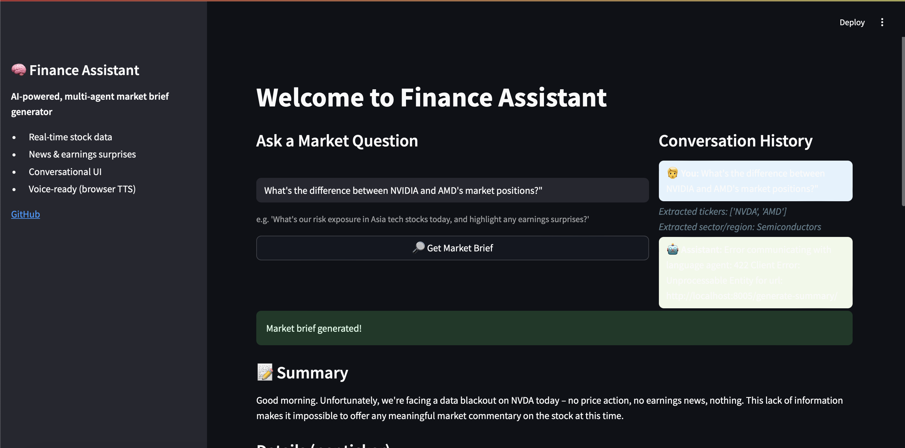
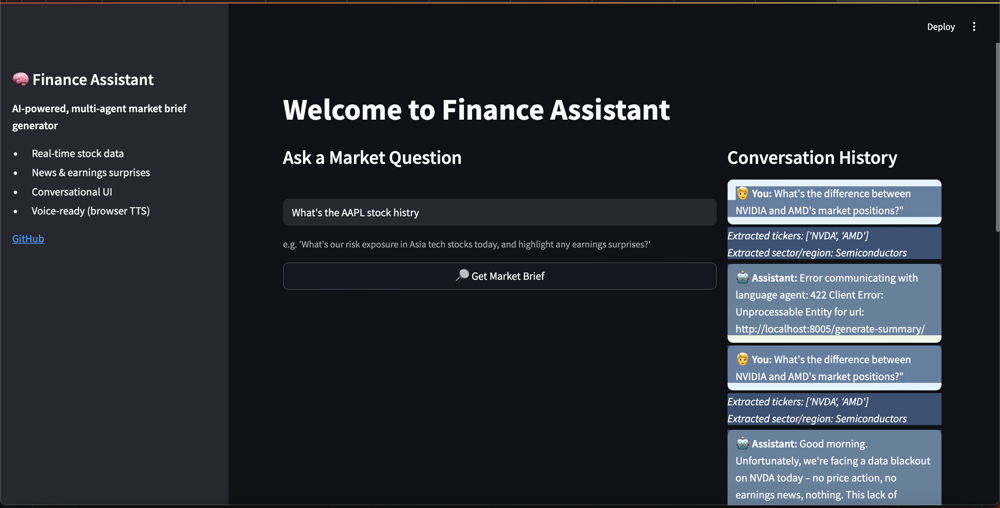
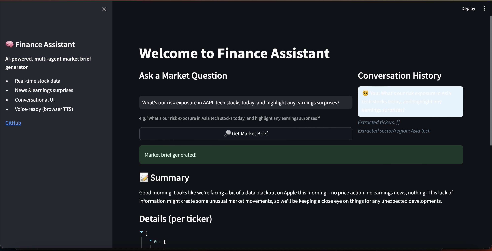

# Finance Assistant

## UI Samples

Below are some screenshots to give you a feel for the Finance Assistant user interface:

| Home Page | Error Handling | Data Blackout Example |
|-----------|---------------|----------------------|
|  <br> *Home page with market question input and features* |  <br> *Clear error message in conversation history* |  <br> *Summary showing data blackout scenario* |

---

Finance Assistant is an AI-powered, multi-agent system that provides market briefs for stocks, including text and voice summaries. It uses a modular microservices architecture with FastAPI agents, an orchestrator, and a Streamlit UI. The project supports both local and Docker-based deployment.

## Features
- Real-time stock data and company overview (via Alpha Vantage)
- Latest earnings news and sentiment
- Semantic search and context retrieval
- AI-generated spoken-style market summaries (Gemini API)
- Text-to-speech (browser-based, no download required)
- Modular, microservices architecture (API, Scraping, Retrieval, Language, Orchestrator, UI)

## Project Structure
```
finance-assistant/
├── backend/
│   ├── agents/
│   │   ├── api_agent/
│   │   ├── scraping_agent/
│   │   ├── retrieval_agent/
│   │   └── language_agent/
│   └── orchestrator/
├── streamlit_app.py
├── requirements.txt
├── docker-compose.yml
├── Dockerfile (for Streamlit UI)
└── ...
```

## Quick Start (with Docker Compose)

1. **Clone the repository**
2. **Set your API keys in `docker-compose.yml`:**
   - `ALPHA_VANTAGE_KEY` (get from https://www.alphavantage.co/support/#api-key)
   - `GOOGLE_API_KEY` (get from Google AI Studio)
3. **Build and run all services:**
   ```bash
   docker-compose up --build
   ```
4. **Access the UI:**
   - Streamlit: [http://localhost:8501](http://localhost:8501)
   - Orchestrator: [http://localhost:8000](http://localhost:8000)
   - Each agent: their respective ports (see docker-compose.yml)

## Manual Setup (Local, without Docker)
1. Install Python 3.11 and create a virtual environment
2. Install dependencies:
   ```bash
   pip install -r requirements.txt
   ```
3. Start each agent and orchestrator in separate terminals:
   ```bash
   uvicorn backend.agents.api_agent.main:app --reload --port 8001
   uvicorn backend.agents.scraping_agent.main:app --reload --port 8002
   uvicorn backend.agents.retrieval_agent.main:app --reload --port 8003
   uvicorn backend.agents.language_agent.main:app --reload --port 8005
   uvicorn backend.orchestrator.main:app --reload --port 8000
   streamlit run streamlit_app.py
   ```

## Usage
- Enter a stock ticker (e.g., AAPL, MSFT, TSM) in the Streamlit UI
- Click "Get Market Brief" to generate a summary
- Click "🔊 Speak Summary" to hear the summary spoken aloud in your browser

## Endpoints
- Orchestrator: `/market-brief/?ticker=TSM` (GET)
- Each agent exposes `/ping` for health checks

## Environment Variables
- Set `ALPHA_VANTAGE_KEY` and `GOOGLE_API_KEY` in your environment or in `docker-compose.yml`

## Notes
- Free Alpha Vantage keys are rate-limited (5 calls/minute, 500/day)
- For production, use Docker Compose for easy deployment and scaling
- All services must be running for the orchestrator and UI to work

## License
MIT
